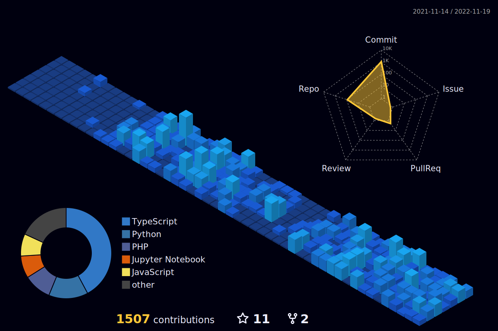

<!--
❗ ➤ References used in this Repository:
🔗 • https://github.com/kyechan99/capsule-render
🔗 • https://github.com/antonkomarev/github-profile-views-counter
🔗 • https://github.com/DenverCoder1/custom-icon-badges
🔗 • https://github.com/DenverCoder1/github-readme-streak-stats
🔗 • https://github.com/anuraghazra/github-readme-stats
🔗 • https://github.com/alexandresanlim/Badges4-README.md-Profile
🔗 • https://profilepicturemaker.com
🔗 • https://devicon.dev
🔗 • https://shields.io
🔗 • https://emoji.gg
🔗 • https://getemoji.com
🔗 • https://github.com/juletopi/juletopi
-->

# <h1 align="center">  Coding: </h1>

<header>
  <link rel="stylesheet" href="https://cdn.jsdelivr.net/gh/devicons/devicon@v2.14.0/devicon.min.css">
</header>

  <a href="https://github.com/AthirsonSilva">
  
  

  
       

  
    
  
<!---======================================================================= Github Stats =================================================================--->

  

    
        

<!---======================================================================================================================================================--->

     
     
  
# <h1 align="center">  Activity: </h1>
  

  

  
 

  

  <a href="#">
    </img>
  </a>

 
  
    
 # <h1 align="center">  Technologies: </h1>

# <h2 align="center">  Data science: </h2>

  
  
  
  
  
  
  
  
    
    
  

# <h2 align="center">  Software engineering: </h2>

<h3 align='center'> Front-end </h3> 

  
  
        
        
        
        
        
        

  
<h3 align='center'> Back-end </h3> 

  
  
    
        
        
         
       

   
# <h1 align="center">  About me: </h1>

- 👋 Hi there, my name is Athirson Silva, and i'm studying to be a software developer.
  
- 📫 I have knowledge in JavaScript, Node.js, Python, Pandas, Numpy, Seaborn and other data science/ machine-learning Python libraries
  
- 📫 I have interest in data science, artificial intelligence, machile learning, and data analysis
  
- 📫 I also have knowledge in web full-stack with PHP/ Node.js, mobile and back-end development with Java and SQL.
  
- 🔭 I’m currently studying analysis and systems development at "Universidade Nove de Julho (UNINOVE)"
  
- 🔭 I’m also studying systems development at "ETEC de Guaianazes" 
  
- 🌱 I’m currently learning Python for data-science/ data-analysis and machine-learning.
  
- 📫 How to reach me: AthirsonArceus@gmail.com
  
- 📫 How to reach me: https://www.linkedin.com/in/athirson-s-a7723a191/
  
   
  

  
  # Education

###

**UNINOVE (Universidade Nove de Julho) - Polo Memorial (Barra-funda/ SP) - Remoto/ EaD** \
[**UNINOVE - Polo Memorial (EaD)**](https://www.uninove.br/) • `Private University` \
Graduation in System Analysis and Development \
<i>Jul. 2021</i> - <i>currently now...</i>
 

**E.E. Major Cosme de Faria (Escola Estadual Major Cosme De Faria) Guaianazes - SP** \
[**E.E. Major Cosme de Faria**](https://www.escol.as/192529-cosme-de-faria-major) • `School & High School` \
Student in School and High School \
<i>Feb. 2014</i> - <i>Dec. 2019</i>
 

**E.E. Major Cosme de Faria (Escola Estadual Major Cosme De Faria) Guaianazes - SP** \
[**E.E. Major Cosme de Faria**](https://www.escol.as/192529-cosme-de-faria-major) • `School & High School` \
Student in School and High School \
<i>Feb. 2014</i> - <i>Dec. 2019</i>
 

**E.E. Major Cosme de Faria (Escola Estadual Major Cosme De Faria) Guaianazes - SP** \
[**E.E. Major Cosme de Faria**](https://www.escol.as/192529-cosme-de-faria-major) • `School & High School` \
Student in School and High School \
<i>Feb. 2014</i> - <i>Dec. 2019</i>
 

###

# <h1 align="center">  Contact me: </h1>
 
 

    
     
 

   
