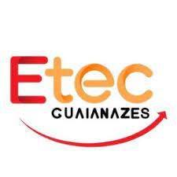

<!--
❗ ➤ References used in this Repository:
🔗 • https://github.com/kyechan99/capsule-render
🔗 • https://github.com/antonkomarev/github-profile-views-counter
🔗 • https://github.com/DenverCoder1/custom-icon-badges
🔗 • https://github.com/DenverCoder1/github-readme-streak-stats
🔗 • https://github.com/anuraghazra/github-readme-stats
🔗 • https://github.com/alexandresanlim/Badges4-README.md-Profile
🔗 • https://profilepicturemaker.com
🔗 • https://devicon.dev
🔗 • https://shields.io
🔗 • https://emoji.gg
🔗 • https://getemoji.com
🔗 • https://github.com/juletopi/juletopi
🔗 • https://github.com/DarkBear0121
-->

###
# 

 

**▸ 🔭 <i> I’m currently studying System Analysis and Development at "Universidade Nove de Julho (UNINOVE)"**

**▸ 🔭 I’m also studied systems development at "ETEC de Guaianazes" from August/ 2021 to December/ 2022**

**▸ 🔭 I can build both hibrid mobile apps, websites and servers/ APIs and make them communicate with each other. </i>**

**▸ 🔭 My hobbies are: League of Legends, Hip-hop, animes, work out, books, memes, coding. </i>**

 

🤓 **▸ Your daily dev inspiration:**

  

 

💬 **▸ Socials & Contacts:**

    &nbsp;&nbsp;
&nbsp;&nbsp;
&nbsp;&nbsp;
&nbsp;&nbsp;
&nbsp;&nbsp;

 

# Education

###

  
  **UNINOVE (Universidade Nove de Julho) - Polo Memorial (Barra-funda/ SP) - Remoto/ EaD** \
  [**UNINOVE - Polo Memorial (EaD)**](https://www.uninove.br/) • `Private University` \
  Graduation in System Analysis and Development \
  <i>Jul. 2021</i> - <i>currently now...</i>
   

  
  **CPS Etec (Centro de educação Paula Souza - Etec de Guaianazes) Guaianazes - SP** \
  [**Etec de Guaianazes**](https://www.cps.sp.gov.br/etecs/etec-de-guaianazes-guaianazes/) • `High School & technical education` \
  Student in System Development Technical education \
  <i>Feb. 2019</i> - <i>Dec. 2022</i>
   
  
 
  
# Coding
  
<header>
  <link rel="stylesheet" href="https://cdn.jsdelivr.net/gh/devicons/devicon@v2.14.0/devicon.min.css">
</header>
  
  
  

  

  

 

 

###

# Technologies and tools

>º
>> #### Everyday (or almost) tools
>>
>> 
>> 
>> 
>> 
>> 
>
>> #### Terminal tools
>>
>> 
>> 
>> 
>> 
>
>> #### Front-end / Mobile
>>
>> 
>> 
>> 
>> 
>> 
>> 
>> 
>
>> #### Back-end
>>
>> 
>> 
>> 
>> 
>> 
>> 
>> 
>> 
>> 
>> 
>> 
>> 
>> 
>> 
>> 
>> 
>> 
>
>> #### DevOps / Databases
>>
>> 
>> 
>> 
>> 
>> 
>> 
>> 
>> 
>> 
>> 
>> 
>> 
>> 
>> 
>> 
>> 
>> 
>
>> Badges by [alexandresanlim](https://github.com/alexandresanlim/Badges4-README.md-Profile#-database- "Click Me")
>>
>> Inspired by [Andreyrvs's](https://github.com/Andreyrvs- "Click Me") awesome profile
>
>º

 &#8196; 

  
